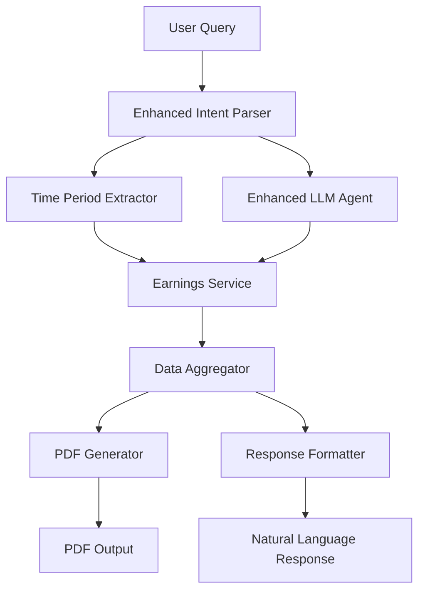

# Enhanced Earnings System Design

## Overview

This design enhances the existing earnings system to provide better natural language query processing, improved PDF generation capabilities, and more accurate earnings calculations. The system will leverage the existing `earningsService.ts`, `intentParser.ts`, and `pdf-generator-earnings.ts` modules while adding new functionality for better user experience.

## Architecture

### Current System Analysis

The existing system has these key components:
- **EarningsService**: Comprehensive earnings calculation with multiple data sources
- **IntentParser**: Basic keyword-based intent recognition 
- **PDF Generator**: Dedicated earnings PDF generation with dynamic content
- **LLM Agent**: Natural language processing for user queries

### Enhanced Architecture



## Components and Interfaces

### 1. Enhanced Intent Parser

**Location**: `src/lib/intentParser.ts` (enhancement)

**New Functionality**:
- Better time period recognition (this month, last month, January, etc.)
- Earnings-specific keyword detection
- PDF generation request detection

```typescript
interface EarningsQuery {
  intent: 'get_earnings' | 'generate_earnings_pdf';
  timeframe?: string;
  month?: string;
  year?: number;
  token?: string;
  network?: string;
  includePdf?: boolean;
}
```

### 2. Time Period Extractor

**Location**: `src/lib/timePeriodExtractor.ts` (new)

**Purpose**: Extract and normalize time periods from natural language

```typescript
interface TimePeriod {
  startDate: string;
  endDate: string;
  displayName: string;
  timeframe: string;
}

export class TimePeriodExtractor {
  static extractFromQuery(query: string): TimePeriod | null;
  static parseMonth(monthText: string, year?: number): TimePeriod;
  static parseRelativeTime(relativeText: string): TimePeriod;
}
```

### 3. Enhanced Earnings Service

**Location**: `src/lib/earningsService.ts` (enhancement)

**New Methods**:
```typescript
export async function getEarningsForNaturalQuery(
  query: string, 
  walletAddresses: string[]
): Promise<EarningsSummaryResponse>;

export async function generateEarningsPdfForQuery(
  query: string,
  walletAddresses: string[],
  userData?: UserData
): Promise<Buffer>;
```

### 4. Enhanced LLM Agent

**Location**: `src/lib/llmAgent.ts` (enhancement)

**New System Prompts**: Add earnings-specific prompts for better recognition

### 5. PDF Generation Enhancement

**Location**: `src/modules/pdf-generator-earnings.ts` (enhancement)

**New Features**:
- Period-specific titles and descriptions
- Comparative data (vs previous period)
- Better formatting for different time ranges

## Data Models

### Enhanced EarningsFilter

```typescript
interface EnhancedEarningsFilter extends EarningsFilter {
  naturalQuery?: string;
  extractedTimeframe?: string;
  comparisonPeriod?: boolean;
  includeInsights?: boolean;
}
```

### PDF Generation Request

```typescript
interface EarningsPdfRequest {
  walletAddresses: string[];
  timeframe?: string;
  startDate?: string;
  endDate?: string;
  userData?: {
    name?: string;
    telegramFirstName?: string;
    telegramLastName?: string;
    telegramUsername?: string;
  };
  includeComparison?: boolean;
}
```

## Error Handling

### Time Period Parsing Errors
- Invalid month names → Default to current month
- Ambiguous periods → Ask for clarification
- Future dates → Return appropriate message

### Data Availability Errors
- No earnings data → Generate empty report with helpful message
- Incomplete data → Show available data with disclaimers

### PDF Generation Errors
- Large datasets → Paginate properly
- Missing user data → Use fallback display names
- Network errors → Retry with exponential backoff

## Testing Strategy

### Unit Tests
1. **Time Period Extractor Tests**
   - Test various natural language inputs
   - Test edge cases (leap years, invalid dates)
   - Test different languages/formats

2. **Intent Parser Enhancement Tests**
   - Test earnings-specific queries
   - Test PDF generation requests
   - Test ambiguous queries

3. **Earnings Service Tests**
   - Test natural query processing
   - Test PDF generation with various data sets
   - Test error handling scenarios

### Integration Tests
1. **End-to-End Query Processing**
   - Natural language query → PDF generation
   - Multiple wallet addresses handling
   - Time period edge cases

2. **PDF Generation Tests**
   - Various data sizes and formats
   - Different time periods
   - User data variations

### Performance Tests
1. **Large Dataset Handling**
   - Test with 1000+ transactions
   - Memory usage during PDF generation
   - Response time optimization

## Implementation Details

### Phase 1: Enhanced Intent Recognition
1. Update `intentParser.ts` with better earnings keywords
2. Add time period extraction logic
3. Enhance LLM prompts for earnings queries

### Phase 2: Time Period Processing
1. Create `TimePeriodExtractor` class
2. Add natural language date parsing
3. Integrate with existing `getDateRange` function

### Phase 3: Enhanced Earnings Service
1. Add natural query processing methods
2. Integrate time period extraction
3. Add PDF generation triggers

### Phase 4: PDF Enhancement
1. Add period-specific content generation
2. Improve formatting for different time ranges
3. Add comparative data display

### Phase 5: Response Formatting
1. Enhance natural language responses
2. Add contextual help messages
3. Improve error messages

## API Endpoints

### New Endpoints

```typescript
// GET /api/earnings/natural-query
interface NaturalEarningsQueryRequest {
  query: string;
  walletAddresses: string[];
  generatePdf?: boolean;
}

// POST /api/earnings/generate-pdf
interface GenerateEarningsPdfRequest {
  walletAddresses: string[];
  timeframe?: string;
  startDate?: string;
  endDate?: string;
  userData?: UserData;
}
```

### Enhanced Existing Endpoints
- Update `/api/earnings` to support natural language queries
- Add PDF generation option to existing endpoints

## Security Considerations

1. **Input Validation**
   - Sanitize natural language queries
   - Validate wallet addresses
   - Limit PDF generation frequency

2. **Data Privacy**
   - Ensure wallet data isolation
   - Secure PDF generation and storage
   - Rate limiting for expensive operations

3. **Resource Management**
   - Limit PDF size and complexity
   - Timeout long-running queries
   - Memory management for large datasets

## Performance Optimizations

1. **Caching Strategy**
   - Cache earnings calculations for common periods
   - Cache PDF generation for identical requests
   - Use Redis for temporary storage

2. **Database Optimization**
   - Index optimization for time-based queries
   - Query optimization for multiple wallet addresses
   - Connection pooling for concurrent requests

3. **PDF Generation Optimization**
   - Streaming PDF generation for large datasets
   - Lazy loading of chart data
   - Compression for final PDF output

## Monitoring and Analytics

1. **Query Analytics**
   - Track most common natural language patterns
   - Monitor query processing times
   - Identify failed parsing attempts

2. **PDF Generation Metrics**
   - Track generation times and sizes
   - Monitor success/failure rates
   - User engagement with generated PDFs

3. **Error Tracking**
   - Log parsing failures with context
   - Track PDF generation errors
   - Monitor system resource usage