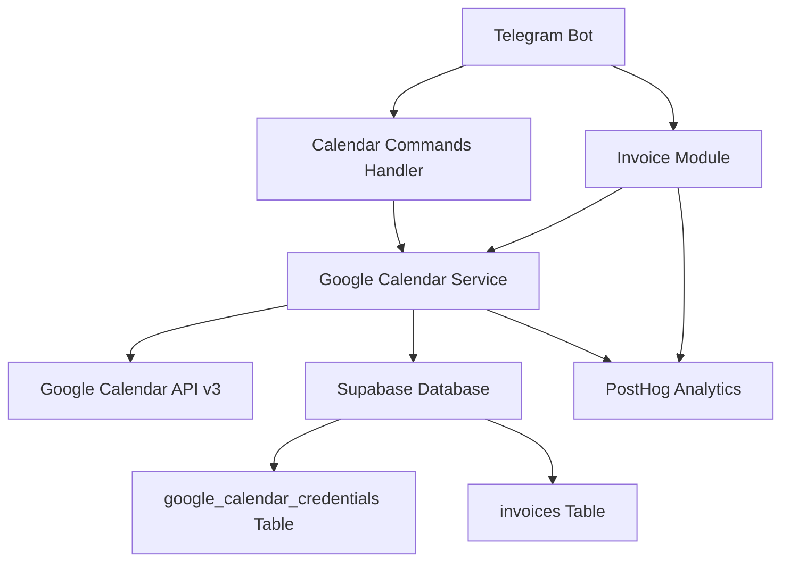
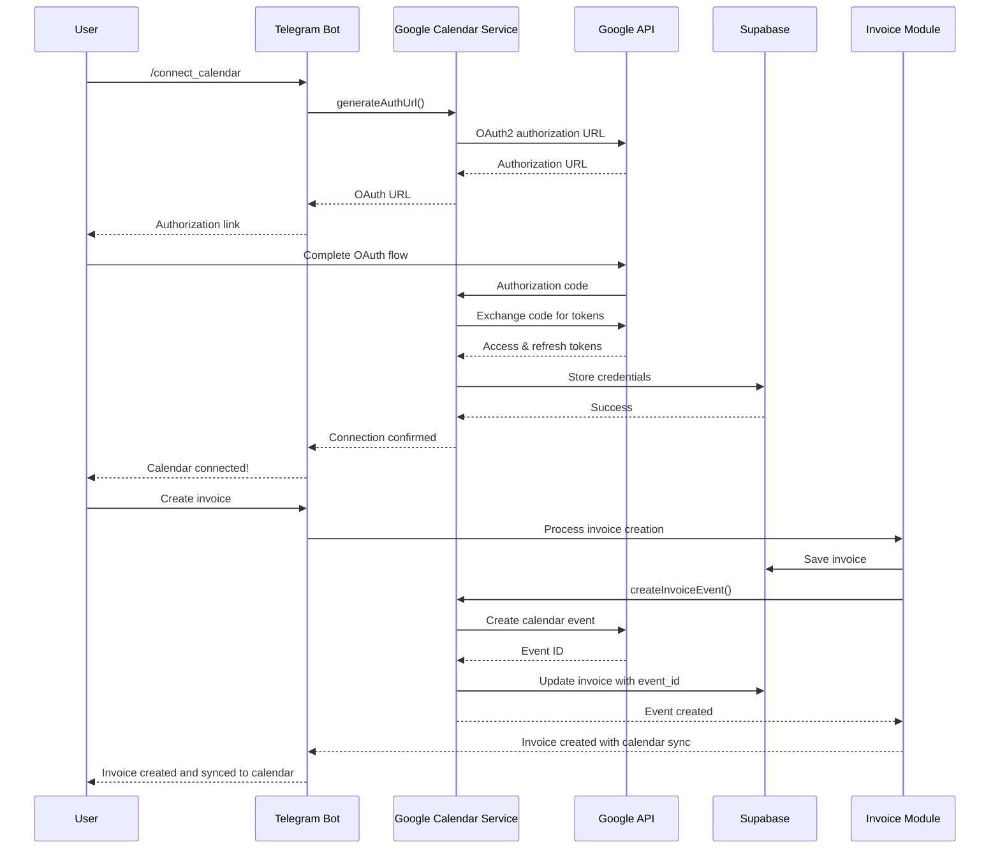

# Google Calendar Sync Design Document

## Overview

The Google Calendar Sync feature integrates Google Calendar into the existing Hedwig Telegram AI assistant, enabling automatic synchronization of invoice due dates with users' personal calendars. The system leverages Google OAuth2 for secure authentication and the Google Calendar API v3 for calendar operations. The integration is designed to be non-intrusive, providing value-added functionality without disrupting existing invoice workflows.

## Architecture

### High-Level Architecture



### Component Interaction Flow



## Components and Interfaces

### 1. Google Calendar Service (Enhanced)

The existing `GoogleCalendarService` class provides the core functionality and will be enhanced with additional methods:

**Key Methods:**
- `generateAuthUrl()`: Generate OAuth2 authorization URL
- `exchangeCodeForTokens(code)`: Exchange authorization code for tokens
- `storeCredentials(userId, credentials)`: Store user credentials securely
- `getCredentials(userId)`: Retrieve user credentials
- `refreshAccessToken(userId)`: Refresh expired access tokens
- `createInvoiceEvent(userId, invoiceData)`: Create calendar event for invoice
- `markInvoiceAsPaid(userId, invoiceData)`: Update event when invoice is paid
- `deleteInvoiceEvent(userId, eventId)`: Delete calendar event
- `disconnectCalendar(userId)`: Remove user credentials
- `isConnected(userId)`: Check connection status
- `testConnection(userId)`: Validate calendar access

### 2. Telegram Bot Calendar Commands Handler

New command handlers will be added to the existing `TelegramBotService`:

```typescript
interface CalendarCommandHandlers {
  handleConnectCalendar(chatId: number, userId: string): Promise<void>;
  handleDisconnectCalendar(chatId: number, userId: string): Promise<void>;
  handleCalendarStatus(chatId: number, userId: string): Promise<void>;
  handleOAuthCallback(chatId: number, userId: string, code: string): Promise<void>;
}
```

### 3. Invoice Module Integration

The existing `InvoiceModule` will be enhanced with calendar integration hooks:

```typescript
interface CalendarIntegrationHooks {
  onInvoiceCreated(invoice: InvoiceData, userId: string): Promise<void>;
  onInvoiceStatusChanged(invoice: InvoiceData, userId: string, newStatus: string): Promise<void>;
  onInvoiceDeleted(invoiceId: string, userId: string, calendarEventId?: string): Promise<void>;
}
```

### 4. Database Schema Extensions

**New Table: `google_calendar_credentials`**
```sql
CREATE TABLE google_calendar_credentials (
  id UUID PRIMARY KEY DEFAULT gen_random_uuid(),
  user_id UUID NOT NULL REFERENCES users(id) ON DELETE CASCADE,
  access_token TEXT NOT NULL,
  refresh_token TEXT NOT NULL,
  calendar_id TEXT DEFAULT 'primary',
  connected_at TIMESTAMP WITH TIME ZONE DEFAULT NOW(),
  updated_at TIMESTAMP WITH TIME ZONE DEFAULT NOW(),
  UNIQUE(user_id)
);
```

**Enhanced `invoices` Table:**
```sql
ALTER TABLE invoices ADD COLUMN calendar_event_id TEXT;
```

### 5. OAuth2 Flow Handler

A new API endpoint for handling OAuth2 callbacks:

```typescript
// /api/calendar/oauth/callback
interface OAuthCallbackHandler {
  method: 'GET';
  query: {
    code: string;
    state: string; // Contains userId and chatId
  };
  response: {
    success: boolean;
    message: string;
  };
}
```

## Data Models

### GoogleCalendarCredentials
```typescript
interface GoogleCalendarCredentials {
  id: string;
  user_id: string;
  access_token: string;
  refresh_token: string;
  calendar_id: string;
  connected_at: string;
  updated_at: string;
}
```

### CalendarEvent
```typescript
interface CalendarEvent {
  id?: string;
  summary: string;
  description: string;
  start: {
    date: string;
    timeZone: string;
  };
  end: {
    date: string;
    timeZone: string;
  };
  reminders: {
    useDefault: boolean;
    overrides: Array<{
      method: 'email' | 'popup';
      minutes: number;
    }>;
  };
}
```

### Enhanced InvoiceData
```typescript
interface InvoiceData {
  // ... existing fields
  calendar_event_id?: string;
}
```

## Error Handling

### Error Categories and Responses

1. **Authentication Errors**
   - Invalid/expired tokens → Prompt user to reconnect
   - OAuth flow failures → Provide clear reconnection instructions
   - Missing credentials → Guide user through connection process

2. **API Errors**
   - Rate limiting → Implement exponential backoff
   - Network failures → Retry with circuit breaker pattern
   - Calendar API errors → Log and provide user-friendly messages

3. **Data Consistency Errors**
   - Missing invoice data → Skip calendar operation, log warning
   - Orphaned calendar events → Cleanup during periodic maintenance
   - Database failures → Graceful degradation without blocking invoice operations

### Error Handling Strategy

```typescript
interface ErrorHandlingStrategy {
  retryPolicy: {
    maxRetries: 3;
    backoffMultiplier: 2;
    initialDelay: 1000; // ms
  };
  fallbackBehavior: 'graceful_degradation';
  userNotification: 'friendly_messages';
  logging: 'comprehensive_with_context';
}
```

## Testing Strategy

### Unit Tests
- Google Calendar Service methods
- OAuth2 flow handling
- Token refresh mechanisms
- Error handling scenarios
- Data validation functions

### Integration Tests
- End-to-end OAuth2 flow
- Calendar event CRUD operations
- Invoice lifecycle with calendar sync
- Error recovery scenarios
- Database transaction integrity

### Test Data Management
```typescript
interface TestDataSets {
  validCredentials: GoogleCalendarCredentials;
  expiredCredentials: GoogleCalendarCredentials;
  sampleInvoices: InvoiceData[];
  mockCalendarEvents: CalendarEvent[];
  errorScenarios: ErrorTestCase[];
}
```

### Mock Services
- Google Calendar API mock for testing
- Supabase mock for database operations
- Telegram Bot API mock for message testing

## Security Considerations

### Token Security
- Store tokens encrypted in database
- Use secure HTTP-only cookies for OAuth state
- Implement token rotation on refresh
- Clear tokens on user disconnect

### API Security
- Validate all user inputs
- Implement rate limiting per user
- Use HTTPS for all external communications
- Sanitize calendar event data

### Privacy Protection
- Minimal data collection (only necessary calendar permissions)
- Clear user consent for calendar access
- Easy disconnection process
- No storage of calendar content beyond event IDs

## Performance Considerations

### Optimization Strategies
- Batch calendar operations when possible
- Implement caching for frequently accessed data
- Use connection pooling for database operations
- Lazy loading of calendar credentials

### Scalability Measures
- Asynchronous processing for calendar operations
- Queue system for high-volume operations
- Database indexing on frequently queried fields
- Monitoring and alerting for performance metrics

### Resource Management
```typescript
interface ResourceLimits {
  maxConcurrentCalendarRequests: 10;
  tokenRefreshCacheTime: 300; // seconds
  calendarOperationTimeout: 30; // seconds
  maxRetryAttempts: 3;
}
```

## Analytics and Monitoring

### PostHog Event Tracking
```typescript
interface CalendarAnalyticsEvents {
  calendar_connected: {
    user_id: string;
    timestamp: string;
    connection_method: 'telegram_command';
  };
  calendar_event_created: {
    user_id: string;
    invoice_id: string;
    event_id: string;
    timestamp: string;
  };
  calendar_event_updated: {
    user_id: string;
    invoice_id: string;
    event_id: string;
    update_type: 'paid' | 'modified';
    timestamp: string;
  };
  calendar_event_deleted: {
    user_id: string;
    invoice_id: string;
    event_id: string;
    timestamp: string;
  };
  calendar_disconnected: {
    user_id: string;
    timestamp: string;
    reason: 'user_request' | 'token_expired' | 'error';
  };
}
```

### Monitoring Metrics
- Calendar connection success rate
- Event creation/update/deletion success rates
- Token refresh success rate
- API response times
- Error rates by category

## Deployment Considerations

### Environment Variables
```typescript
interface CalendarEnvironmentConfig {
  GOOGLE_CLIENT_ID: string;
  GOOGLE_CLIENT_SECRET: string;
  GOOGLE_REDIRECT_URI: string;
  CALENDAR_FEATURE_ENABLED: boolean;
}
```

### Database Migrations
- Create `google_calendar_credentials` table
- Add `calendar_event_id` column to `invoices` table
- Create necessary indexes for performance
- Set up proper foreign key constraints

### Feature Flags
- Gradual rollout capability
- A/B testing support
- Emergency disable functionality
- User-specific feature enablement

This design provides a comprehensive foundation for implementing Google Calendar sync while maintaining the existing system's reliability and user experience.