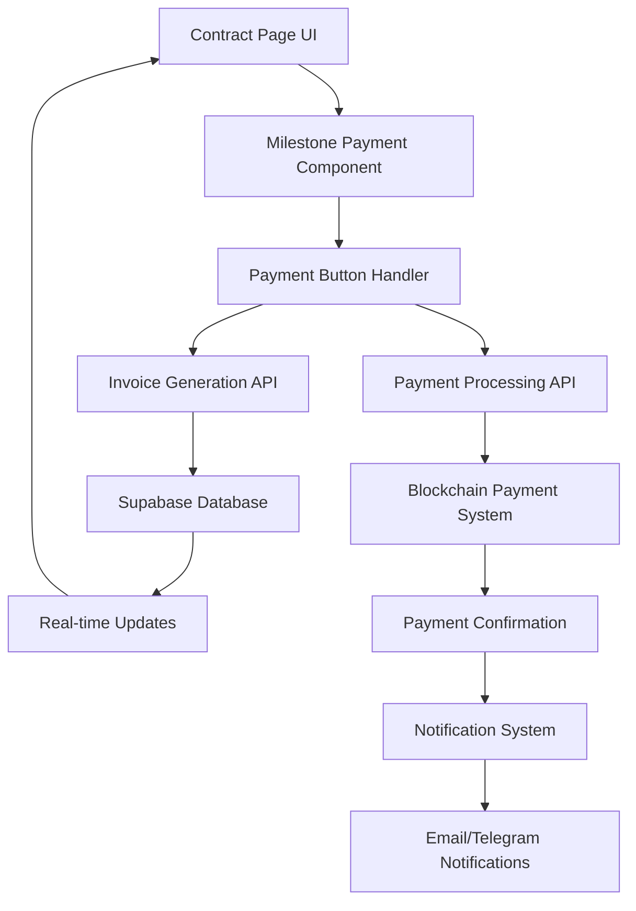

# Milestone Payment Enhancement Design

## Overview

This design document outlines the technical implementation for enhancing the milestone payment system to provide seamless payment access for clients directly from the contract interface. The solution integrates existing invoice generation and payment systems while adding new UI components and API endpoints to support direct milestone payments.

## Architecture

### High-Level Architecture



### System Components

1. **Enhanced Contract Interface**: Updated contract page with integrated payment functionality
2. **Milestone Payment Component**: Reusable component for milestone payment actions
3. **Invoice Auto-Generation Service**: Ensures invoices exist for all approved milestones
4. **Payment Integration Layer**: Connects milestone payments to existing invoice payment system
5. **Real-time Status Updates**: Live updates for payment status changes
6. **Enhanced Notification System**: Improved notifications for payment events

## Components and Interfaces

### 1. Enhanced MilestoneProgress Component

**Location**: `src/components/ui/ProgressBar.tsx`

**New Props**:
```typescript
interface MilestoneProgressProps {
  milestones: Milestone[];
  totalAmount: number;
  currency: string;
  contractId: string;
  isFreelancer: boolean;
  isClient: boolean;
  onPaymentInitiated?: (milestoneId: string) => void;
  onBulkPaymentInitiated?: (milestoneIds: string[]) => void;
}
```

**Enhanced Features**:
- Payment buttons for approved milestones
- Bulk payment option when all milestones are completed
- Payment status indicators
- Loading states during payment processing
- Error handling and retry mechanisms

### 2. Milestone Payment Button Component

**Location**: `src/components/ui/MilestonePaymentButton.tsx`

```typescript
interface MilestonePaymentButtonProps {
  milestone: Milestone;
  contractId: string;
  currency: string;
  onPaymentClick: (milestoneId: string) => void;
  disabled?: boolean;
  loading?: boolean;
}
```

**Features**:
- Dynamic button states (Pay Now, Processing, Paid)
- Amount display with currency
- Visual feedback for different states
- Accessibility compliance

### 3. Bulk Payment Component

**Location**: `src/components/ui/BulkPaymentButton.tsx`

```typescript
interface BulkPaymentButtonProps {
  milestones: Milestone[];
  contractId: string;
  currency: string;
  totalAmount: number;
  onBulkPayment: (milestoneIds: string[]) => void;
}
```

**Features**:
- Summary of unpaid milestones
- Total amount calculation
- Confirmation dialog
- Progress tracking for bulk operations

### 4. Payment Status Indicator Component

**Location**: `src/components/ui/PaymentStatusIndicator.tsx`

```typescript
interface PaymentStatusIndicatorProps {
  status: 'pending' | 'paid' | 'overdue' | 'processing';
  amount: number;
  currency: string;
  paidDate?: string;
  transactionHash?: string;
}
```

## Data Models

### Enhanced Milestone Model

```typescript
interface Milestone {
  id: string;
  title: string;
  description: string;
  amount: number;
  deadline: string;
  status: 'pending' | 'in_progress' | 'completed' | 'approved';
  // New payment-related fields
  invoice_id?: string;
  payment_status: 'unpaid' | 'paid' | 'processing' | 'failed';
  paid_at?: string;
  transaction_hash?: string;
  payment_amount?: number;
}
```

### Payment Request Model

```typescript
interface PaymentRequest {
  milestoneIds: string[];
  contractId: string;
  totalAmount: number;
  currency: string;
  paymentType: 'single' | 'bulk';
}
```

### Payment Response Model

```typescript
interface PaymentResponse {
  success: boolean;
  invoiceIds: string[];
  redirectUrl?: string;
  error?: string;
  paymentSummary?: {
    totalAmount: number;
    currency: string;
    milestoneCount: number;
  };
}
```

## API Endpoints

### 1. Milestone Payment Initiation

**Endpoint**: `POST /api/milestones/payment/initiate`

**Request Body**:
```json
{
  "milestoneIds": ["milestone-id-1", "milestone-id-2"],
  "contractId": "contract-id",
  "paymentType": "single" | "bulk"
}
```

**Response**:
```json
{
  "success": true,
  "invoiceIds": ["invoice-id-1", "invoice-id-2"],
  "redirectUrl": "/invoice/invoice-id-1",
  "paymentSummary": {
    "totalAmount": 1000,
    "currency": "USDC",
    "milestoneCount": 2
  }
}
```

**Logic**:
1. Validate milestone IDs and contract ownership
2. Check if invoices exist for milestones
3. Generate missing invoices automatically
4. Return invoice IDs and redirect URL
5. Handle bulk payment by creating combined invoice or separate invoices

### 2. Invoice Auto-Generation

**Endpoint**: `POST /api/milestones/[id]/generate-invoice`

**Request Body**:
```json
{
  "milestoneId": "milestone-id",
  "contractId": "contract-id"
}
```

**Response**:
```json
{
  "success": true,
  "invoiceId": "generated-invoice-id",
  "invoice": {
    "id": "invoice-id",
    "amount": 500,
    "currency": "USDC",
    "status": "draft"
  }
}
```

**Logic**:
1. Fetch milestone and contract details
2. Create invoice with milestone-specific information
3. Link invoice to milestone in database
4. Return invoice details for immediate use

### 3. Payment Status Update

**Endpoint**: `POST /api/milestones/[id]/payment-status`

**Request Body**:
```json
{
  "status": "paid" | "failed" | "processing",
  "transactionHash": "0x...",
  "paidAmount": 500,
  "paidAt": "2024-01-01T00:00:00Z"
}
```

**Response**:
```json
{
  "success": true,
  "milestone": {
    "id": "milestone-id",
    "payment_status": "paid",
    "paid_at": "2024-01-01T00:00:00Z"
  }
}
```

### 4. Bulk Payment Processing

**Endpoint**: `POST /api/contracts/[id]/bulk-payment`

**Request Body**:
```json
{
  "milestoneIds": ["id1", "id2", "id3"],
  "paymentMethod": "combined" | "separate"
}
```

**Response**:
```json
{
  "success": true,
  "paymentType": "combined",
  "invoiceId": "bulk-invoice-id",
  "redirectUrl": "/invoice/bulk-invoice-id",
  "summary": {
    "totalAmount": 1500,
    "milestoneCount": 3,
    "currency": "USDC"
  }
}
```

## Enhanced Contract Page Integration

### Updated Contract Page Structure

```typescript
// Enhanced contract page with payment integration
export default function ContractPage({ contract, error }: ContractPageProps) {
  const [paymentLoading, setPaymentLoading] = useState<string | null>(null);
  const [bulkPaymentLoading, setBulkPaymentLoading] = useState(false);

  const handleMilestonePayment = async (milestoneId: string) => {
    setPaymentLoading(milestoneId);
    try {
      const response = await fetch('/api/milestones/payment/initiate', {
        method: 'POST',
        headers: { 'Content-Type': 'application/json' },
        body: JSON.stringify({
          milestoneIds: [milestoneId],
          contractId: contract.id,
          paymentType: 'single'
        })
      });
      
      const result = await response.json();
      if (result.success) {
        router.push(result.redirectUrl);
      }
    } catch (error) {
      console.error('Payment initiation failed:', error);
    } finally {
      setPaymentLoading(null);
    }
  };

  const handleBulkPayment = async () => {
    const unpaidMilestones = contract.milestones.filter(
      m => m.status === 'approved' && m.payment_status !== 'paid'
    );
    
    setBulkPaymentLoading(true);
    try {
      const response = await fetch(`/api/contracts/${contract.id}/bulk-payment`, {
        method: 'POST',
        headers: { 'Content-Type': 'application/json' },
        body: JSON.stringify({
          milestoneIds: unpaidMilestones.map(m => m.id),
          paymentMethod: 'combined'
        })
      });
      
      const result = await response.json();
      if (result.success) {
        router.push(result.redirectUrl);
      }
    } catch (error) {
      console.error('Bulk payment failed:', error);
    } finally {
      setBulkPaymentLoading(false);
    }
  };

  // ... rest of component
}
```

### Payment Section in Contract UI

```jsx
{/* Enhanced Milestones Section with Payment Integration */}
{contract.milestones && contract.milestones.length > 0 && (
  <div className="bg-white rounded-lg shadow-sm p-6 mb-6">
    <div className="flex justify-between items-center mb-4">
      <h2 className="text-lg font-semibold text-gray-900">Project Milestones</h2>
      {isClient && hasUnpaidApprovedMilestones && (
        <BulkPaymentButton
          milestones={unpaidApprovedMilestones}
          contractId={contract.id}
          currency={getTokenSymbol(contract.token_address)}
          totalAmount={calculateUnpaidTotal()}
          onBulkPayment={handleBulkPayment}
          loading={bulkPaymentLoading}
        />
      )}
    </div>
    
    <MilestoneProgress 
      milestones={contract.milestones}
      totalAmount={contract.total_amount}
      currency={getTokenSymbol(contract.token_address)}
      contractId={contract.id}
      isFreelancer={isFreelancer}
      isClient={isClient}
      onPaymentInitiated={handleMilestonePayment}
      onBulkPaymentInitiated={handleBulkPayment}
    />
  </div>
)}
```

## Error Handling

### Payment Error Types

```typescript
enum PaymentErrorType {
  INVOICE_GENERATION_FAILED = 'invoice_generation_failed',
  WALLET_NOT_CONNECTED = 'wallet_not_connected',
  INSUFFICIENT_FUNDS = 'insufficient_funds',
  NETWORK_ERROR = 'network_error',
  MILESTONE_NOT_APPROVED = 'milestone_not_approved',
  ALREADY_PAID = 'already_paid'
}

interface PaymentError {
  type: PaymentErrorType;
  message: string;
  retryable: boolean;
  suggestedAction?: string;
}
```

### Error Handling Strategy

1. **Invoice Generation Failures**: Automatic retry with exponential backoff
2. **Payment Processing Errors**: User-friendly error messages with retry options
3. **Network Issues**: Offline detection and retry mechanisms
4. **Validation Errors**: Clear feedback with corrective actions
5. **Wallet Connection Issues**: Guided reconnection flow

## Testing Strategy

### Unit Tests

1. **Component Testing**:
   - MilestonePaymentButton component states
   - BulkPaymentButton functionality
   - PaymentStatusIndicator display logic
   - Error handling in payment components

2. **API Testing**:
   - Payment initiation endpoint validation
   - Invoice generation logic
   - Bulk payment processing
   - Error response handling

### Integration Tests

1. **Payment Flow Testing**:
   - End-to-end milestone payment process
   - Bulk payment functionality
   - Invoice generation and linking
   - Status update propagation

2. **UI Integration Testing**:
   - Contract page payment integration
   - Real-time status updates
   - Error state handling
   - Loading state management

### End-to-End Tests

1. **Complete Payment Scenarios**:
   - Single milestone payment
   - Bulk milestone payment
   - Payment failure recovery
   - Status synchronization

2. **User Journey Testing**:
   - Client payment experience
   - Freelancer notification flow
   - Error recovery paths
   - Cross-browser compatibility

## Performance Considerations

### Optimization Strategies

1. **Lazy Loading**: Load payment components only when needed
2. **Caching**: Cache invoice data and payment status
3. **Debouncing**: Prevent duplicate payment requests
4. **Progressive Enhancement**: Graceful degradation for slow connections
5. **Real-time Efficiency**: Optimize WebSocket connections for status updates

### Monitoring and Analytics

1. **Payment Metrics**: Track payment success rates and failure reasons
2. **Performance Monitoring**: Monitor API response times and error rates
3. **User Experience Tracking**: Measure payment completion times
4. **Error Analytics**: Analyze common failure patterns for improvement

## Security Considerations

### Payment Security

1. **Input Validation**: Strict validation of all payment-related inputs
2. **Authorization**: Verify client permissions for milestone payments
3. **Rate Limiting**: Prevent payment spam and abuse
4. **Transaction Verification**: Validate blockchain transactions
5. **Audit Logging**: Log all payment-related actions for security review

### Data Protection

1. **Sensitive Data Handling**: Secure handling of payment information
2. **Access Control**: Role-based access to payment functions
3. **Encryption**: Encrypt sensitive payment data in transit and at rest
4. **Compliance**: Ensure compliance with financial regulations
5. **Privacy Protection**: Protect user financial information

This design provides a comprehensive solution for enhancing the milestone payment system while maintaining security, performance, and user experience standards.