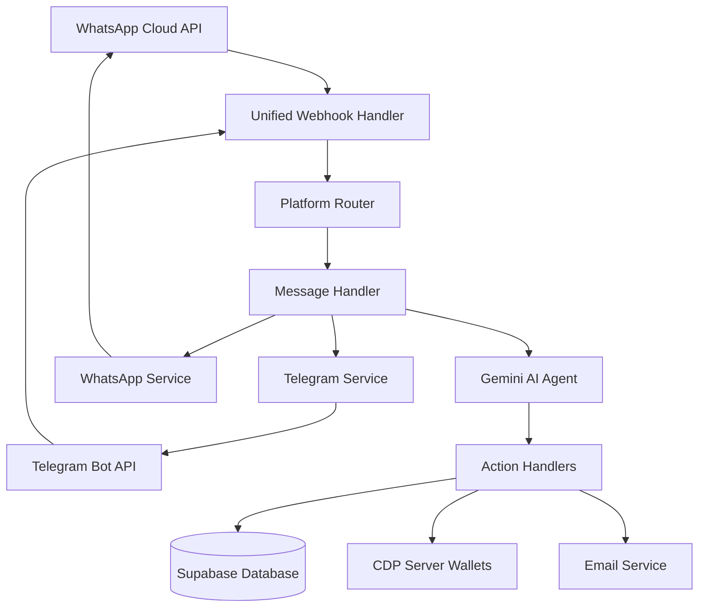
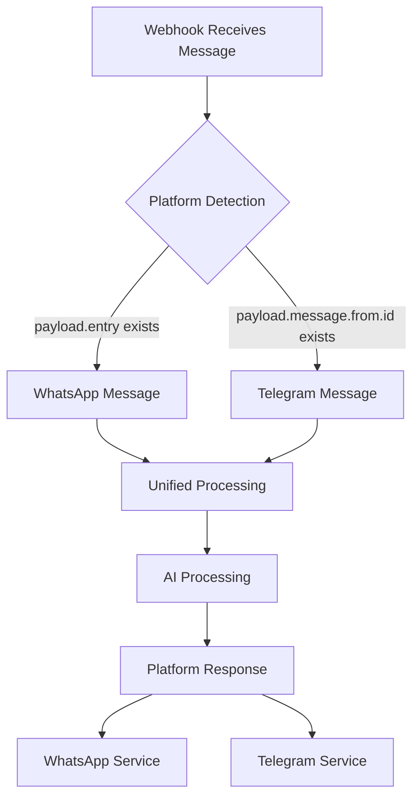

# Design Document

## Overview

This document outlines the technical design for integrating WhatsApp as a new front-end interface for the Hedwig AI assistant. The design ensures seamless operation alongside the existing Telegram bot while maintaining a unified backend architecture and shared user experience.

## Architecture

### High-Level Architecture



### Platform Detection Flow



## Components and Interfaces

### 1. Platform Router

**Purpose**: Detect incoming message platform and route to appropriate handlers

**Interface**:
```typescript
interface PlatformRouter {
  detectPlatform(payload: any): 'whatsapp' | 'telegram' | 'unknown';
  routeMessage(platform: string, payload: any): Promise<void>;
}
```

**Implementation**:
- Analyzes payload structure to identify platform
- WhatsApp: presence of `entry` field in payload
- Telegram: presence of `message.from.id` field in payload
- Routes to unified message processing pipeline

### 2. WhatsApp Service

**Purpose**: Handle WhatsApp-specific API interactions

**Interface**:
```typescript
interface WhatsAppService {
  sendMessage(phoneNumber: string, message: string): Promise<void>;
  sendInteractiveMessage(phoneNumber: string, message: InteractiveMessage): Promise<void>;
  verifyWebhook(token: string, challenge: string): boolean;
  parseIncomingMessage(payload: any): ParsedMessage;
}

interface ParsedMessage {
  from: string; // phone number
  text: string;
  messageId: string;
  timestamp: number;
}

interface InteractiveMessage {
  text: string;
  buttons?: Button[];
  listItems?: ListItem[];
}
```

**Implementation**:
- Uses Meta WhatsApp Cloud API v20.0
- Handles message sending via `/messages` endpoint
- Manages webhook verification with `META_VERIFY_TOKEN`
- Parses incoming webhook payloads

### 3. Unified Message Handler

**Purpose**: Process messages from both platforms using shared logic

**Interface**:
```typescript
interface UnifiedMessageHandler {
  processMessage(platform: string, userId: string, message: string): Promise<string>;
  handleUserOnboarding(platform: string, userInfo: UserInfo): Promise<User>;
  linkExistingUser(email: string, platform: string, platformId: string): Promise<User>;
}

interface UserInfo {
  platformId: string; // telegram_chat_id or whatsapp_phone
  firstName?: string;
  lastName?: string;
  username?: string;
  phoneNumber?: string;
}
```

**Implementation**:
- Maintains conversation context across platforms
- Routes to existing AI processing pipeline
- Handles user identification and linking

### 4. User Management Service

**Purpose**: Manage user records across platforms

**Interface**:
```typescript
interface UserManagementService {
  findUserByEmail(email: string): Promise<User | null>;
  findUserByPlatform(platform: string, platformId: string): Promise<User | null>;
  createUser(userInfo: CreateUserInfo): Promise<User>;
  linkPlatform(userId: string, platform: string, platformId: string): Promise<void>;
  getOrCreateWallet(userId: string): Promise<Wallet>;
}

interface CreateUserInfo {
  email?: string;
  name?: string;
  platform: 'telegram' | 'whatsapp';
  telegram_chat_id?: number;
  telegram_username?: string;
  telegram_first_name?: string;
  telegram_last_name?: string;
  whatsapp_phone?: string;
  whatsapp_name?: string;
}
```

## Data Models

### Enhanced User Schema

```sql
-- Add new columns to existing users table
ALTER TABLE users ADD COLUMN platform TEXT DEFAULT 'telegram';
ALTER TABLE users ADD COLUMN whatsapp_phone TEXT;
ALTER TABLE users ADD COLUMN whatsapp_name TEXT;
ALTER TABLE users ADD COLUMN linked_platforms JSONB DEFAULT '[]';

-- Create index for WhatsApp phone lookup
CREATE INDEX idx_users_whatsapp_phone ON users(whatsapp_phone);

-- Create index for platform-specific queries
CREATE INDEX idx_users_platform ON users(platform);
```

### Platform Mapping Table

```sql
-- Optional: Create separate table for platform mappings
CREATE TABLE user_platforms (
  id UUID PRIMARY KEY DEFAULT gen_random_uuid(),
  user_id UUID REFERENCES users(id) ON DELETE CASCADE,
  platform TEXT NOT NULL CHECK (platform IN ('telegram', 'whatsapp')),
  platform_user_id TEXT NOT NULL,
  platform_username TEXT,
  platform_display_name TEXT,
  is_primary BOOLEAN DEFAULT false,
  created_at TIMESTAMP WITH TIME ZONE DEFAULT NOW(),
  updated_at TIMESTAMP WITH TIME ZONE DEFAULT NOW(),
  UNIQUE(platform, platform_user_id)
);
```

### Message Log Enhancement

```sql
-- Add platform column to existing message logs
ALTER TABLE message_logs ADD COLUMN platform TEXT DEFAULT 'telegram';
ALTER TABLE message_logs ADD COLUMN platform_message_id TEXT;
```

## Error Handling

### WhatsApp API Error Handling

```typescript
class WhatsAppErrorHandler {
  handleApiError(error: WhatsAppApiError): void {
    switch (error.code) {
      case 131026: // Message undeliverable
        this.logUndeliverableMessage(error);
        break;
      case 131047: // Re-engagement message
        this.handleReEngagement(error);
        break;
      case 131051: // Unsupported message type
        this.sendFallbackMessage(error);
        break;
      default:
        this.logGenericError(error);
    }
  }
}
```

### Rate Limiting

```typescript
interface RateLimiter {
  checkLimit(phoneNumber: string): Promise<boolean>;
  incrementCounter(phoneNumber: string): Promise<void>;
  getTimeToReset(phoneNumber: string): Promise<number>;
}
```

**Implementation**:
- WhatsApp Business API limits: 1000 messages per second
- Per-user rate limiting: 10 messages per minute
- Exponential backoff for API failures

## Testing Strategy

### Unit Tests

1. **Platform Detection Tests**
   - Test WhatsApp payload recognition
   - Test Telegram payload recognition
   - Test unknown payload handling

2. **WhatsApp Service Tests**
   - Mock WhatsApp Cloud API responses
   - Test message sending functionality
   - Test webhook verification

3. **User Management Tests**
   - Test user creation and linking
   - Test platform association
   - Test wallet creation integration

### Integration Tests

1. **End-to-End Message Flow**
   - WhatsApp message → AI processing → WhatsApp response
   - Cross-platform user identification
   - Wallet operations via WhatsApp

2. **Database Integration**
   - User record creation and updates
   - Platform linking functionality
   - Message logging across platforms

### Load Testing

1. **Concurrent Message Handling**
   - Test webhook handling under load
   - Verify database connection pooling
   - Test AI processing queue management

2. **WhatsApp API Limits**
   - Test rate limiting implementation
   - Verify error handling for API limits
   - Test message queuing for high volume

## Security Considerations

### Webhook Security

1. **WhatsApp Webhook Verification**
   - Verify `META_VERIFY_TOKEN` on webhook setup
   - Validate webhook signatures for incoming messages
   - Implement HTTPS-only webhook endpoints

2. **Input Validation**
   - Sanitize all incoming message content
   - Validate phone number formats
   - Prevent injection attacks in user data

### Data Protection

1. **Phone Number Handling**
   - Hash phone numbers for database storage
   - Implement data retention policies
   - Ensure GDPR compliance for EU users

2. **Cross-Platform Privacy**
   - Secure user linking process
   - Audit trail for platform associations
   - User consent for data sharing

## Performance Optimization

### Caching Strategy

```typescript
interface CacheStrategy {
  userCache: Map<string, User>; // Platform ID → User
  sessionCache: Map<string, ConversationContext>;
  rateLimitCache: Map<string, RateLimit>;
}
```

### Database Optimization

1. **Indexing Strategy**
   - Index on `whatsapp_phone` for quick user lookup
   - Composite index on `(platform, platform_user_id)`
   - Index on `linked_platforms` JSONB field

2. **Connection Pooling**
   - Separate connection pools for read/write operations
   - Connection pooling for high-concurrency webhook handling

### Message Processing

1. **Async Processing**
   - Queue-based message processing for high volume
   - Separate queues for different message types
   - Priority queuing for time-sensitive operations

2. **Response Optimization**
   - Template-based responses for common queries
   - Cached AI responses for frequently asked questions
   - Streaming responses for long-running operations

## Deployment Considerations

### Environment Variables

```bash
# WhatsApp Configuration
WHATSAPP_TOKEN=your_whatsapp_access_token
WHATSAPP_PHONE_NUMBER_ID=your_phone_number_id
META_VERIFY_TOKEN=your_webhook_verification_token
WHATSAPP_WEBHOOK_URL=https://yourdomain.com/api/webhook

# Feature Flags
WHATSAPP_ENABLED=true
CROSS_PLATFORM_LINKING=true
```

### Monitoring and Logging

1. **Platform-Specific Metrics**
   - WhatsApp message volume and success rates
   - Cross-platform user conversion rates
   - API response times and error rates

2. **Business Metrics**
   - User engagement across platforms
   - Feature usage comparison (Telegram vs WhatsApp)
   - Revenue attribution by platform

### Rollout Strategy

1. **Phase 1: Core Integration**
   - Basic message handling and AI processing
   - User onboarding and wallet creation
   - Essential features (balance, send, payment links)

2. **Phase 2: Advanced Features**
   - Invoice and proposal creation
   - Contract management
   - Cross-platform user linking

3. **Phase 3: Optimization**
   - Performance improvements
   - Advanced analytics
   - Enhanced user experience features