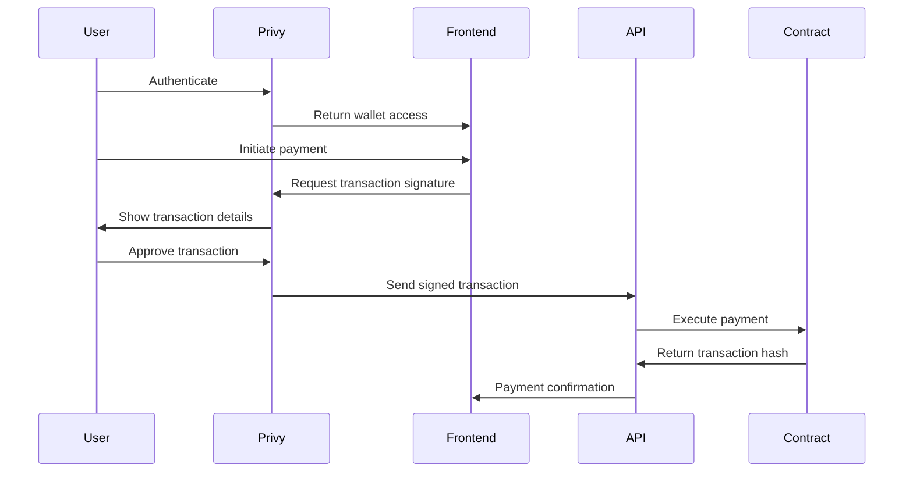

# Hedwig Payment Contract Deployment Guide

## 🚀 Deploying to Base Sepolia

### Prerequisites

1. **Deployer Wallet**: `0x29B30cd52d9e8DdF9ffEaFb598715Db78D3B771d`
2. **Base Sepolia ETH**: Ensure the deployer wallet has sufficient ETH for gas fees
3. **Environment Setup**: Configure your `.env.local` file

### Step 1: Generate Admin Key

```bash
node scripts/generate-admin-key.js
```

Save the generated admin key securely - you'll need it for contract management.

### Step 2: Configure Environment

Create/update your `.env.local` file:

```bash
# Platform wallet (where fees will be collected)
HEDWIG_PLATFORM_WALLET_TESTNET=0x29B30cd52d9e8DdF9ffEaFb598715Db78D3B771d

# Private key for the deployer wallet (for deployment and admin operations)
PLATFORM_PRIVATE_KEY=your_private_key_here

# Base Sepolia RPC
BASE_SEPOLIA_RPC_URL=https://sepolia.base.org

# Admin key (generated in Step 1)
HEDWIG_ADMIN_KEY=your_generated_admin_key

# Platform fee (in basis points, 250 = 2.5%)
HEDWIG_PLATFORM_FEE=250

# Privy configuration (existing)
PRIVY_APP_ID=your_privy_app_id
PRIVY_APP_SECRET=your_privy_app_secret
PRIVY_KEY_QUORUM_ID=your_privy_key_quorum_id
PRIVY_AUTHORIZATION_KEY=your_privy_authorization_key

# Supabase (existing)
NEXT_PUBLIC_SUPABASE_URL=your_supabase_url
SUPABASE_SERVICE_ROLE_KEY=your_supabase_service_role_key
```

### Step 3: Deploy Contract

```bash
npx hardhat run scripts/deploy-hedwig-payment.js --network base-sepolia
```

The deployment will:
- Deploy the HedwigPayment contract
- Set the platform wallet
- Whitelist initial tokens (USDC on Base Sepolia)
- Output contract address and configuration

### Step 4: Update Environment with Contract Address

Add the deployed contract address to your `.env.local`:

```bash
HEDWIG_PAYMENT_CONTRACT_ADDRESS_TESTNET=0x_deployed_contract_address
```

### Step 5: Verify Contract (Optional)

If you have a Basescan API key:

```bash
# Add to .env.local
BASESCAN_API_KEY=your_basescan_api_key

# Verification will happen automatically during deployment
```

## 🔗 Privy Integration

### How Privy Wallets Work with Smart Contracts

1. **User Authentication**: Users authenticate with Privy
2. **Wallet Access**: Privy provides wallet access through embedded wallets
3. **Transaction Signing**: Users sign transactions through Privy's interface
4. **Smart Contract Interaction**: Signed transactions interact with the HedwigPayment contract

### Payment Flow with Privy



### Integration Points

1. **Invoice Creation**: 
   - Frontend creates invoice with Privy wallet address
   - Invoice stored in Supabase with user's Privy ID

2. **Payment Processing**:
   - User connects Privy wallet
   - Frontend calls `/api/payment/process` with payment details
   - API validates and processes payment through smart contract

3. **Event Handling**:
   - Smart contract emits `PaymentReceived` events
   - Backend listens for events via `/api/payment/events`
   - Updates invoice status in Supabase

## 🧪 Testing the Integration

### 1. Test Contract Deployment

```bash
# Check contract is deployed
npx hardhat console --network base-sepolia

# In console:
const contract = await ethers.getContractAt("HedwigPayment", "YOUR_CONTRACT_ADDRESS");
console.log(await contract.platformWallet());
console.log(await contract.platformFee());
```

### 2. Test Privy Integration

1. **Frontend Test**:
   - Go to your invoice page
   - Connect Privy wallet
   - Attempt a test payment

2. **API Test**:
   ```bash
   curl -X POST http://localhost:3000/api/payment/process \
     -H "Content-Type: application/json" \
     -d '{
       "token": "0x036CbD53842c5426634e7929541eC2318f3dCF7e",
       "amount": "1000000",
       "freelancer": "0x_freelancer_address",
       "invoiceId": "test-invoice-123"
     }'
   ```

### 3. Test Admin Functions

```bash
# Test admin API
curl -X GET http://localhost:3000/api/admin/wallet-config \
  -H "x-admin-key: YOUR_ADMIN_KEY"
```

## 🔧 Configuration Management

### Platform Wallet Management

```bash
# Update platform wallet
curl -X POST http://localhost:3000/api/admin/wallet-config \
  -H "x-admin-key: YOUR_ADMIN_KEY" \
  -H "Content-Type: application/json" \
  -d '{
    "action": "setPlatformWallet",
    "walletAddress": "0x_new_wallet_address"
  }'
```

### Fee Management

```bash
# Update platform fee (250 = 2.5%)
curl -X POST http://localhost:3000/api/admin/wallet-config \
  -H "x-admin-key: YOUR_ADMIN_KEY" \
  -H "Content-Type: application/json" \
  -d '{
    "action": "setPlatformFee",
    "fee": 250
  }'
```

### Token Management

```bash
# Whitelist new token
curl -X POST http://localhost:3000/api/admin/wallet-config \
  -H "x-admin-key: YOUR_ADMIN_KEY" \
  -H "Content-Type: application/json" \
  -d '{
    "action": "whitelistToken",
    "tokenAddress": "0x_token_address",
    "status": true
  }'
```

## 🚨 Security Considerations

1. **Admin Key Security**:
   - Store admin key in secure environment variables
   - Never commit to version control
   - Rotate periodically

2. **Private Key Management**:
   - Use hardware wallets for mainnet deployments
   - Implement multi-sig for production

3. **Contract Verification**:
   - Always verify contracts on Basescan
   - Audit contract code before mainnet deployment

4. **Privy Security**:
   - Configure Privy with proper domain restrictions
   - Use HTTPS in production
   - Implement proper session management

## 📊 Monitoring

### Contract Events

Monitor these events for payment tracking:

```solidity
event PaymentReceived(
    address indexed token,
    uint256 amount,
    address indexed freelancer,
    string invoiceId,
    uint256 fee,
    uint256 freelancerPayout
);
```

### API Endpoints for Monitoring

- `GET /api/payment/events` - Get payment events
- `GET /api/admin/wallet-config` - Check contract configuration
- `POST /api/payment/process` - Process payments

## 🔄 Mainnet Migration

When ready for mainnet:

1. Update network in deployment script
2. Use mainnet token addresses
3. Deploy with production private keys
4. Update environment variables
5. Verify contract on mainnet Basescan

## 📞 Support

For deployment issues:
1. Check contract deployment logs
2. Verify environment variables
3. Test with Base Sepolia faucet tokens
4. Review Privy integration logs