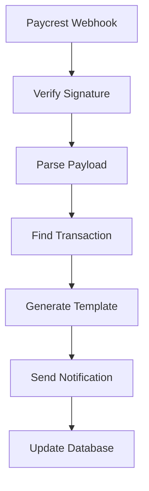
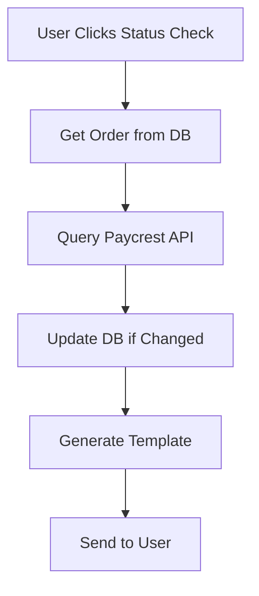

# Offramp Status Templates Implementation Guide

## Overview

This guide documents the comprehensive offramp status template system that provides rich, user-friendly notifications for all Paycrest withdrawal statuses. The system eliminates "Unknown status" errors and provides consistent, professional messaging across all offramp operations.

## 🎯 Key Features

### ✅ Complete Status Coverage
- **15+ Status Templates** covering all Paycrest API statuses
- **Fallback handling** for unknown statuses
- **Rich messaging** with emojis, progress indicators, and next steps
- **Interactive keyboards** with relevant action buttons

### ✅ Smart Notification Logic
- **Immediate notifications** for terminal and critical statuses
- **Progress updates** for significant status changes
- **Spam prevention** to avoid overwhelming users
- **Priority levels** (low/medium/high) for different status types

### ✅ Multi-Channel Integration
- **Paycrest Webhook** integration for real-time updates
- **Telegram Bot** callback handling for status checks
- **Database synchronization** for status tracking
- **API endpoints** for manual status queries

## 📁 File Structure

```
src/
├── lib/
│   └── offrampStatusTemplates.ts          # Core template system
├── pages/api/
│   ├── webhooks/
│   │   └── paycrest.ts                    # Webhook integration
│   ├── test-offramp-templates-integration.ts  # Integration tests
│   └── test-offramp-status-templates.ts   # Template tests
└── modules/
    └── bot-integration.ts                 # Telegram bot integration
```

## 🔧 Core Components

### 1. OfframpStatusTemplates Class

Located in `src/lib/offrampStatusTemplates.ts`

#### Key Methods:
- `getStatusTemplate(status, data)` - Generate complete template
- `getStatusEmoji(status)` - Get status emoji
- `getStatusText(status)` - Get user-friendly status text

#### Supported Statuses:
- **Success**: `completed`, `fulfilled`, `success`, `settled`, `delivered`
- **Processing**: `pending`, `processing`, `awaiting_transfer`, `in_progress`, `submitted`, `confirming`
- **Failed**: `failed`, `error`, `cancelled`, `rejected`, `declined`
- **Refund**: `refunded`, `refund_pending`, `refund_processing`, `refund_completed`
- **Expired**: `expired`, `timeout`
- **On Hold**: `on_hold`, `under_review`, `requires_verification`

### 2. Webhook Integration

Located in `src/pages/api/webhooks/paycrest.ts`

#### Features:
- **Real-time processing** of Paycrest webhook events
- **Template-based notifications** for all status updates
- **Database synchronization** with transaction records
- **Referral points** awarded for successful completions

#### Webhook Events Handled:
- `order.status.updated`
- `order.completed`
- `order.failed`
- `order.updated`

### 3. Telegram Bot Integration

Located in `src/modules/bot-integration.ts`

#### Features:
- **Status check callbacks** via `check_offramp_status_{orderId}`
- **Fresh API queries** to get latest status
- **Template rendering** for consistent messaging
- **Error handling** for missing orders

## 📋 Status Template Examples

### Processing Status
```
🔄 **Withdrawal In Progress**

Your withdrawal is being processed by Test Bank.

💰 **Amount:** 100 NGN
📋 **Order ID:** test-order-123
⏰ **Status:** Processing

⏳ **Estimated completion:** 5-15 minutes
📱 **You'll receive a notification when complete**

Please be patient while we process your withdrawal.
```

### Completed Status
```
✅ **Withdrawal Completed Successfully!**

🎉 Your funds have been delivered to Test Bank!

💰 **Amount:** 100 NGN
🏦 **Recipient:** John Doe
📋 **Order ID:** test-order-123
⏰ **Completed:** Dec 15, 2024 10:30 AM

💡 **Your funds should appear in your account within 2-5 minutes.**

Thank you for using Hedwig! 🚀
```

### Failed Status
```
❌ **Withdrawal Failed**

We're sorry, your withdrawal could not be completed.

💰 **Amount:** 100 NGN
📋 **Order ID:** test-order-123
❗ **Reason:** Technical issue occurred

🔄 **Next Steps:**
• Your USDC will be automatically refunded
• Refund typically takes 5-10 minutes
• You'll receive a notification when complete

💬 Need help? Contact our support team.
```

## 🔄 Integration Flow

### 1. Webhook Processing


### 2. Status Check Flow


## 🧪 Testing

### Template Testing
```bash
POST /api/test-offramp-status-templates
{
  "status": "settled",
  "orderId": "test-123",
  "amount": "100",
  "currency": "NGN"
}
```

### Integration Testing
```bash
POST /api/test-offramp-templates-integration
{
  "status": "processing",
  "orderId": "test-order-123",
  "testWebhook": true,
  "testBotCallback": true
}
```

## 🚀 Usage Examples

### 1. Manual Status Check
```typescript
import { OfframpStatusTemplates } from '../lib/offrampStatusTemplates';

const template = OfframpStatusTemplates.getStatusTemplate('completed', {
  orderId: 'order-123',
  amount: 100,
  currency: 'NGN',
  token: 'USDC',
  network: 'base',
  recipient: {
    institution: 'First Bank',
    accountName: 'John Doe',
    accountIdentifier: '1234567890',
    currency: 'NGN'
  }
});

// Send to Telegram
await bot.sendMessage(chatId, template.text, {
  parse_mode: template.parse_mode,
  reply_markup: template.reply_markup
});
```

### 2. Webhook Processing
```typescript
// In webhook handler
const { OfframpStatusTemplates } = await import('../../../lib/offrampStatusTemplates');
const template = OfframpStatusTemplates.getStatusTemplate(status, orderData);
await sendTemplatedNotification(userId, template);
```

### 3. Bot Callback Handling
```typescript
// In bot integration
async handleOfframpStatusCheck(chatId: number, userId: string, orderId: string) {
  const { OfframpStatusTemplates } = await import('../lib/offrampStatusTemplates');
  const template = OfframpStatusTemplates.getStatusTemplate(currentStatus, orderData);
  
  await this.bot.sendMessage(chatId, template.text, {
    parse_mode: template.parse_mode,
    reply_markup: template.reply_markup
  });
}
```

## 🔧 Configuration

### Environment Variables
```env
PAYCREST_API_BASE_URL=https://api.paycrest.io/v1
PAYCREST_API_SECRET=your_paycrest_secret
PAYCREST_WEBHOOK_SECRET=your_webhook_secret
TELEGRAM_BOT_TOKEN=your_bot_token
```

### Database Schema
```sql
-- offramp_transactions table should have:
- id (uuid)
- user_id (uuid)
- paycrest_order_id (text)
- status (text)
- amount (numeric)
- currency (text)
- token (text)
- network (text)
- created_at (timestamp)
- updated_at (timestamp)
```

## 🐛 Troubleshooting

### Common Issues

1. **"Unknown status" errors**
   - ✅ **Fixed**: All statuses now have templates
   - Fallback template handles any unknown status

2. **Missing notifications**
   - Check webhook signature verification
   - Verify database transaction exists
   - Check Telegram bot token

3. **Template rendering issues**
   - Verify data structure matches `OfframpStatusData` interface
   - Check for missing required fields

### Debug Endpoints

- `GET /api/test-offramp-status-templates` - Test template generation
- `GET /api/test-offramp-templates-integration` - Test full integration
- Check webhook logs in Paycrest dashboard

## 📈 Benefits

### For Users
- **Clear communication** about withdrawal status
- **Proactive updates** without manual checking
- **Professional appearance** with consistent branding
- **Actionable buttons** for next steps

### For Developers
- **No more unknown status errors**
- **Consistent messaging** across all channels
- **Easy to extend** with new statuses
- **Comprehensive testing** coverage

### For Business
- **Reduced support tickets** from confused users
- **Professional brand image** with polished notifications
- **Better user experience** leading to higher retention
- **Scalable system** that handles growth

## 🔄 Future Enhancements

1. **Multi-language support** for international users
2. **Custom templates** per user preferences
3. **Rich media** support (images, videos)
4. **Analytics** on notification engagement
5. **A/B testing** for message optimization

## 📞 Support

For issues or questions about the offramp status template system:

1. Check the test endpoints for debugging
2. Review webhook logs in Paycrest dashboard
3. Verify database transaction records
4. Test template generation manually

The system is designed to be robust and handle all edge cases, providing a seamless experience for users regardless of their withdrawal status.